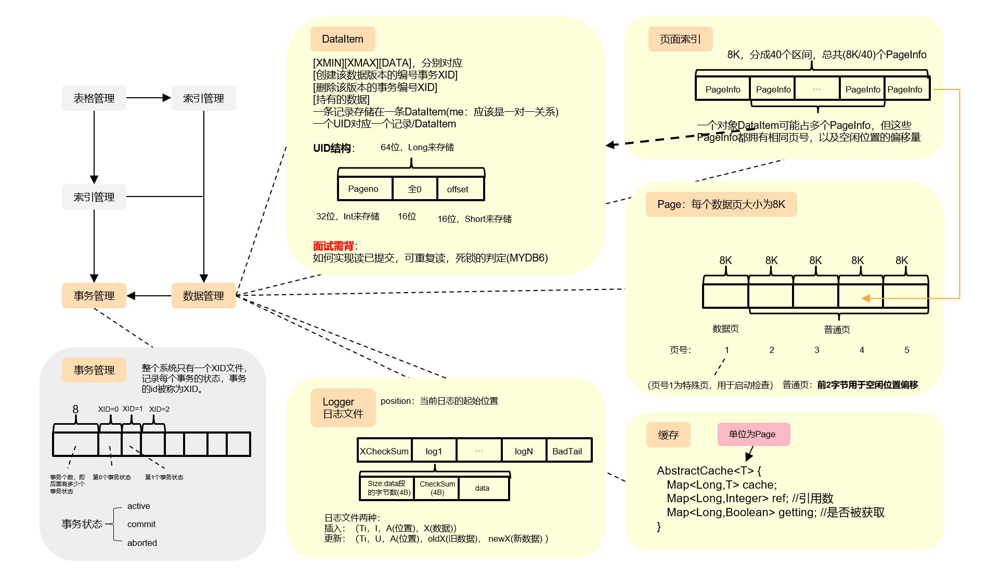

# MYDB:简易实现手写数据库

MYDB 是一个 Java 实现的简单的数据库，来自[原作者代码](https://github.com/senshinya/MYDB)以及[原作者教程](https://shinya.click/projects/mydb/mydb1/)。

花了几天时间阅读了之后，部分存在比较难懂的地方，于是在仓库代码中结合了自己理解给原代码添加了许多便于理解的注释，可以理解成阅读笔记，并且将核心的逻辑关系总结成了两张图，如下所示。建议想学习该项目的javaer，结合这份添加了注释后的代码以及[原作者教程](https://shinya.click/projects/mydb/mydb1/)来相互理解，迷糊的时候再结合下面两张图片梳理梳理逻辑关系。

逻辑关系图1：

  

逻辑关系图2：

  

